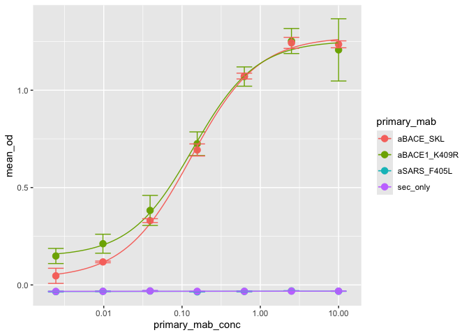

<!-- README.md is generated from README.Rmd. Please edit that file -->

# elisa

<!-- badges: start -->
<!-- badges: end -->

The goal of elisa is to plot ELISA data from an specially formatted csv
or excel file. The main function is `plot_elisa` which uses ggplot2
under the hood to make a smooth line plot using the LL.4() argument from
the `drc` package.

## Installation

You can install the development version of elisa from
[GitHub](https://github.com/) with:

``` r
# install.packages("pak")
pak::pak("shubhamdutta26/elisa")
```

## Example

This is a basic example which shows you how plot ELISA data:

``` r
library(elisa)
file <- system.file("extdata", "elisa_example.xlsx", package = "elisa")
plot_elisa(file,
           group = c(primary_mab, primary_mab_conc),
           x = primary_mab_conc,
           plot_group = primary_mab,
           xlog = TRUE, errorbars = TRUE)
#> Data: elisa_example.xlsx; Plate type: 96-well plate
#> `geom_smooth()` using formula = 'y ~ x'
#> Warning in sqrt(diag(varMat)): NaNs produced
#> Warning in sqrt(diag(varMat)): NaNs produced
```



More updates will be posted at a later time.
